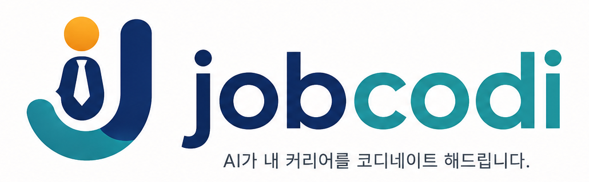

# JobCodi Frontend

<p align="center">
  
</p>

**JobCodi** 프런트엔드 pnpm 모노레포. 취준생이 목표를 입력하면 AI가 대화로 검색 조건을 정교화하고, 서버가 모아온 채용 공고를 보여준다.

> 2026-07-31 전면 개편. 이전 플로우(이력서 업로드 · 이력 분석 · 중요도 슬라이더 · 종합 리포트)는 제거되었다. 배경은 backend 레포의 [PRD §8](https://github.com/JobCodi/backend/blob/main/docs/product/prd.md#8-개편-배경).

## 모노레포 구조

```text
frontend/
├── apps/
│   └── web/              @jobcodi/web · Next.js App Router 실행 앱
├── docs/                 제품·UX·데이터 흐름 정본
├── package.json          workspace 공통 명령·도구 버전
└── pnpm-workspace.yaml
```

현재는 배포 가능한 Next.js 앱 하나만 둔다. 공용 UI·도메인 패키지는 실제 두 번째 소비자가 생길 때만 추가한다. 제품 기능 코드를 빈 shared 패키지로 쪼개지 않는다.

## 역할

랜딩부터 목표 입력, 5턴 AI 대화, 조건 확인, 공고 피드까지의 사용자 여정을 소유한다.

```text
①  /start                         목표 입력 (기업 규모 · 직군 · 경력 · 지역)
②  /discovery/:sessionId          AI 대화 5턴
③  /discovery/:sessionId/criteria 조건 확인·수정
④  /feed/:sessionId               공고 피드
```

## 문서

| 문서 | 내용 |
| --- | --- |
| [제품 개요](docs/product.md) | 프론트가 책임지는 범위, UX 원칙, 접근성 |
| [사이트맵](docs/sitemap.md) | 라우트 구조, 플로우, 복귀 처리 |
| [화면 명세](docs/screens.md) | 화면별 구성·상태·API·엣지 케이스 |
| [데이터 흐름](docs/data-flow.md) | 상태 소유권, 쿼리 키, 폴링, 에러 경계 |
| [디자인 시스템](docs/design-system.md) | 토큰, 컴포넌트 계층 |

## 스택

- Next.js App Router (Server Components 우선)
- React + TypeScript strict
- Tailwind CSS + shadcn/ui
- TanStack Query (서버 상태), Zustand (클라이언트 전용 상태)
- zod (API 응답 경계 검증)

## 시작하기

```bash
pnpm install --frozen-lockfile
cp apps/web/.env.example apps/web/.env.local
```

백엔드가 `http://localhost:4000`에 떠 있어야 한다.

```bash
pnpm dev:web
```

## 명령어

| 명령 | 설명 |
| --- | --- |
| `pnpm dev:web` | Next.js 개발 서버 |
| `pnpm build` | 웹 앱 프로덕션 빌드 |
| `pnpm lint` | 웹 앱 ESLint |
| `pnpm typecheck` | 웹 앱 TypeScript strict 검사 |
| `pnpm start:web` | 빌드된 웹 앱 실행 |
| `pnpm clean` | 생성된 Next.js 산출물 제거 |

> 현재 Next.js 16.2.x는 pnpm workspace의 App Router를 Turbopack root로 잘못 인식하는 upstream 회귀가 있다([vercel/next.js#92540](https://github.com/vercel/next.js/issues/92540)). 따라서 `dev`와 `build`는 검증된 Webpack 모드로 실행한다. 이슈가 해결된 안정 릴리스에서 Turbopack 재활성화를 재검토한다.

## 환경 변수

`apps/web/.env.example`을 참고한다.

```bash
NEXT_PUBLIC_APP_URL=http://localhost:3000
NEXT_PUBLIC_API_BASE_URL=http://localhost:4000
```

AI 프로바이더 키는 프론트엔드에 두지 않는다. 대화는 전부 백엔드 API를 경유한다.

## 핵심 규칙

- **점수 옆에는 항상 매칭 근거가 있다.** 백엔드가 `reasons`를 필수로 내려준다. `reasons`가 빈 카드는 렌더하지 않는다.
- **점수를 클라이언트에서 재계산하지 않는다.** 서버가 준 `score`를 그대로 쓴다.
- **공고 본문을 표시하지 않는다.** 서버가 주지 않는다. 상세는 원문 링크로 보낸다.
- **서버 상태를 Zustand에 복제하지 않는다.** TanStack Query 캐시가 정본이다.
- Server Components 우선. `'use client'`는 상호작용하는 잎 컴포넌트까지 내린다.
- Next.js 15+에서 `params`와 `searchParams`는 Promise다. 항상 await한다.

## 워크플로

1. GitHub Issue에서 시작
2. PR은 하나의 사용자 플로우 또는 컴포넌트 영역으로 작게 유지
3. UI가 바뀌면 스크린샷이나 수동 QA 노트를 PR에 포함
4. 조직 PR 템플릿 사용
